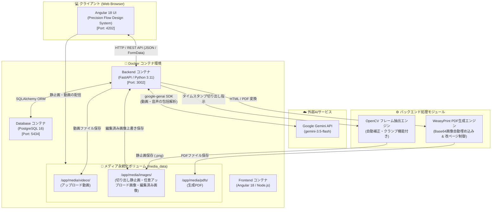

# 手順書生成アプリケーション (ManualAI)

動画ファイルをアップロードするだけで、AI（Google Gemini API）が映像と音声を解析し、自動的に画像付き手順書（Markdown）を生成・管理・エクスポートできるWebアプリケーションです。

---

## 🏛 システムアーキテクチャ

本アプリケーションは、**Docker Compose** によるマルチコンテナ構成（Angular + FastAPI + PostgreSQL）で構築されており、外部AI（Google Gemini 3.5 Flash）および OpenCV / WeasyPrint エンジンと連携して動作します。

### アーキテクチャ構成図



---

## 🌟 主な機能

### 1. 手順書の自動生成
* **AIによる動画・音声解析**: アップロードされた動画から音声文字起こしと操作手順のステップ化を自動実行。
* **日本語出力の強制指示 (NEW 🌐)**: 動画内の音声言語に関わらず、すべてのマニュアルテキストを必ず自然な日本語で生成。
* **AIモデル選択機能 (NEW 🤖)**: 解析スピードや推論精度に応じた Gemini モデル（`Gemini 3.5 Flash` [デフォルト], `Gemini 3.6 Flash`, `Gemini 3.5 Flash Lite`, `Gemini 3 Pro Preview`, `Gemini 2.5 Pro`）を画面上で切り替え可能。
* **静止画の自動切り出し**: OpenCV を活用し、AIが推奨するキーフレーム（タイムスタンプ）から静止画を自動抽出し、手順書へ埋め込み。
* **プロンプトカスタマイズ**: 生成時に「初心者に分かりやすく」「安全確認を重視」などの追加指示を設定可能。

### 2. 手順書の編集・リアルタイムプレビュー
* **Google Stitch (Precision Flow) デザイン**: 洗練されたライトテーマ、共通サイドバーナビゲーション（直近手順書5件のクイックアクセス対応）、Bentoカードレイアウト。
* **対話型2カラムエディタ**:
  * **左カラム**: 動画プレイヤー、タイムラインシークバー、静止画切り出し（キャプチャ）、任意のローカル画像追加 (NEW 🖼)、使用画像リスト、Markdownエディタ。
  * **右カラム**: 印刷・ドキュメント用にスタイリングされたリアルタイムプレビューペーパー。
* **テキスト & 画像の自由な編集**:
  * **カーソル位置挿入 & スクロール位置保持 (NEW ✍️)**: 画像挿入や「改ページを挿入」ボタンの押下時、本文末尾ではなくエディタ内の現在のカーソル位置へピンポイント挿入。挿入時の画面跳び（自動スクロール）を防止。
  * **サムネイル画面90%フルフレーム超拡大ホバープレビュー (NEW 🔍)**: 使用画像一覧の右上マーク (🔍) へマウスオーバーするだけで、ブラウザ画面の 90% 領域（90vw/88vh）まで画像自体を限界拡大して即座に表示。
  * 動画から抽出した切り出し静止画に加え、PC内の任意画像ファイル（PNG, JPG, WebP等）を編集画面から自由に追加・アップロード可能。
  * 切り出し画像（タイムスタンプバッジ表示・動画シーク連動）と追加画像（「アップロード」緑バッジ表示）を視覚的にわかりやすく識別。
* **動画再生 & タイムラインシーク (NEW 🎥)**:
  * FastAPI による **HTTP Range Requests (`206 Partial Content`)** 対応。全ブラウザでのスムーズな動画タイムラインシークを実現。
  * 切り出し画像のタイムスタンプ（例: `7.0s`）をクリックすると動画の該当位置へ即座にジャンプ。
* **AIプロンプト指示による本文修正・補正 (NEW ✨)**:
  * 「⚠️ 注意点を追加」「🔰 初心者向けに平易化」「📌 箇条書き整理」「🔍 誤字脱字校正」などのプロンプト指示を入力することで、AIが画像タグや構造を保ったまま手順書本文をリアルタイムにリライト・補正。

### 3. 静止画のインライン編集機能 (NEW 🎨)
* **キャンバスエディタモーダル**:
  * **✂️ 画像の切り抜き (Crop)**: ドラッグ選択で必要なエリアのみをトリミング。
  * **🔴/🟦/➡️ 注釈図形描画**: 操作対象や強調箇所を示す「丸」「四角」「矢印」を直感的に描画。
  * **📐 画像サイズ調整**: ワンクリックでの `100%` (元サイズ復元), `75%`, `50%` 縮小。
  * **カラー & 太さカスタマイズ**: 6色のテーマカラーと3段階の線幅を自由に設定可能。
  * **Undo / リセット**: 取り消し機能および初期画像への復元機能。
* **爆速・0秒即時キャッシュ更新 (NEW ⚡)**:
  * 保存した編集画像は動的キャッシュバスター（`?v=${timestamp}`）により、一覧サムネイルおよび Markdown プレビュー内の画像へ0秒で即座に最新反映。

### 4. 多彩なフォーマットでのエクスポート
* **PDFドキュメント**:
  * WeasyPrint を用いた高品質な A4 印刷レイアウト出力。
  * **明示的改ページ制御 (NEW 📄)**: 本文内に `<!-- pagebreak -->` または `[pagebreak]` を記述（エディタの「改ページを挿入」ボタンでワンクリック挿入）することで、指定した特定位置で確実に強制改ページを実行。
  * **改ページまたぎ防止**: 手順ブロック (`.step-block`) の境界泣き別れを完全に防ぐ `break-inside: avoid;` 制御。
  * **画像自動スケーリング (NEW 🖼)**: A4 ページの縦幅に合わせて画像を最適高さへ自動縮小 (`max-height: 105mm; object-fit: contain;`)。
* **Webページ (HTML)**: 画像を Base64 Data URI で完全埋め込んだ、単体で動作するスタンドアロン HTML 出力。
* **Markdown (.md)**: 他のドキュメントツールやリポジトリで活用できる生データ出力。

### 5. 詳細なエラーメッセージ通知 (NEW 🚨)
* Gemini API 呼び出し時にエラーが発生した場合、クレジット不足 (429)、認証エラー (401/403)、サーバー障害 (500)、通信タイムアウトなどの**具体的で分かりやすい原因メッセージ**を画面上に日本語で即座に通知。

### 6. 手順書管理（ダッシュボード）
* カード形式での手順書一覧表示、検索・編集・削除機能。
* サイドバーからの直近作成・更新手順書（5件）へのダイレクトアクセス。

---

## 🛠 技術スタック

* **フロントエンド**: Angular 18 (TypeScript), HTML5 Canvas API, Google Stitch (Precision Flow Design System), `ngx-markdown`, Lucide Icons
* **バックエンド**: Python 3.11, FastAPI, SQLAlchemy, OpenCV (`opencv-python-headless`), WeasyPrint, Jinja2
* **AI / マルチモーダル**: Google Gemini API (`google-genai` SDK / `gemini-3.5-flash`)
* **データベース**: PostgreSQL 16
* **コンテナ環境**: Docker / Docker Compose

---

## 🚀 ポート配置

本アプリケーションは、既存アプリケーションとの衝突を防ぐため以下のポートを使用します。

| サービス | ホストポート | 内部ポート | URL / 備考 |
| :--- | :--- | :--- | :--- |
| **Frontend** (Angular) | `4202` | `4200` | `http://localhost:4202` |
| **Backend** (FastAPI) | `3002` | `8000` | `http://localhost:3002` (Swagger UI: `/docs`) |
| **Database** (PostgreSQL) | `5434` | `5432` | `localhost:5434` |

---

## 📦 セットアップ & 起動手順

### 前提条件
* [Docker](https://www.docker.com/) および Docker Compose がインストールされていること。
* [Google AI Studio](https://aistudio.google.com/) の API キー (`GEMINI_API_KEY`) を取得済みであること。

### 1. リポジトリのクローン
```bash
git clone https://github.com/n-yamai/manual-creator.git
cd manual-creator
```

### 2. 環境変数 (.env) の設定
プロジェクトルートにある `.env.example` をコピーして `.env` ファイルを作成し、ご自身の Gemini API キーを設定します。

```bash
cp .env.example .env
```

`.env` 内を編集:
```env
GEMINI_API_KEY=your_actual_gemini_api_key_here
```

### 3. Docker コンテナのビルドと起動
```bash
docker-compose up --build -d
```

### 4. Web UI へアクセス
ブラウザを開き、[http://localhost:4202](http://localhost:4202) にアクセスしてください。

---

## 📜 変更履歴 (Release History)

各バージョンの詳細な機能追加・不具合修正の履歴については [HISTORY.md](./HISTORY.md) をご参照ください。

---

## 📂 プロジェクト構成

```text
manual-creator/
├── docker-compose.yml        # Docker Compose オーケストレーション設定
├── .env.example              # 環境変数設定テンプレート
├── README.md                 # プロジェクトドキュメント
├── HISTORY.md                # 変更・リリース履歴ログ
├── backend/                  # FastAPI バックエンド
│   ├── Dockerfile
│   ├── main.py               # API エンドポイント (画像編集・HTML/PDF生成・AI補正)
│   ├── models.py             # PostgreSQL データモデル
│   ├── schemas.py            # リクエスト/レスポンススキーマ
│   ├── requirements.txt      # Python パッケージ依存一覧
│   └── services/             # Gemini API, OpenCV, PDF 生成サービス
└── frontend/                 # Angular フロントエンド
    ├── Dockerfile
    ├── src/
    │   ├── app/
    │   │   ├── components/   # Dashboard, ManualCreator, ManualEditor (Canvas画像編集)
    │   │   └── services/     # API 通信サービス
    │   └── styles.css        # Precision Flow グローバルデザインスタイル
    └── package.json
```

---

## 📄 ライセンス

MIT License
