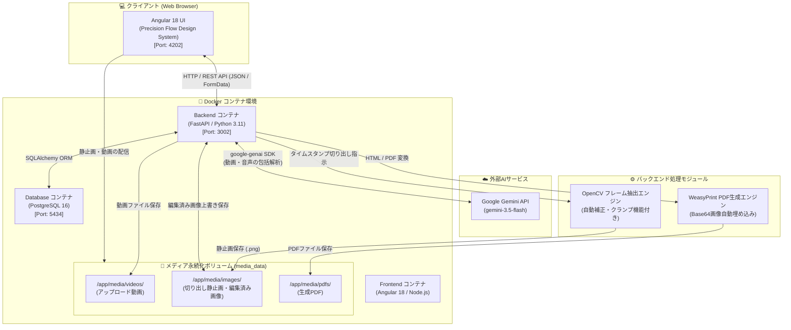

# 手順書生成アプリケーション (Procedure Manual Creator)

動画ファイルをアップロードするだけで、AI（Google Gemini API）が映像と音声を解析し、自動的に画像付き手順書（Markdown）を生成・管理・エクスポートできるWebアプリケーションです。

---

## 🏛 システムアーキテクチャ

本アプリケーションは、**Docker Compose** によるマルチコンテナ構成（Angular + FastAPI + PostgreSQL）で構築されており、外部AI（Google Gemini 3.5 Flash）および OpenCV / WeasyPrint エンジンと連携して動作します。

### アーキテクチャ構成図



---

## 🌟 主な機能

### 1. 手順書の自動生成
* **AIによる動画・音声解析**: アップロードされた動画から音声文字起こしと操作手順のステップ化を自動実行。
* **AIモデル選択機能 (NEW 🤖)**: 解析スピードや推論精度に応じた Gemini モデル（`Gemini 3.5 Flash` [デフォルト], `Gemini 3.6 Flash`, `Gemini 3.5 Flash Lite`, `Gemini 3 Pro Preview`, `Gemini 2.5 Pro`）を画面上で切り替え可能。
* **静止画の自動切り出し**: OpenCV を活用し、AIが推奨するキーフレーム（タイムスタンプ）から静止画を自動抽出し、手順書へ埋め込み。
* **プロンプトカスタマイズ**: 生成時に「初心者に分かりやすく」「安全確認を重視」などの追加指示を設定可能。


### 2. 手順書の編集・リアルタイムプレビュー
* **Google Stitch (Precision Flow) デザイン**: 洗練されたライトテーマ、共通サイドバーナビゲーション（直近手順書5件のクイックアクセス対応）、Bentoカードレイアウト。
* **対話型2カラムエディタ**:
  * **左カラム**: 動画プレイヤー、タイムラインシークバー、静止画切り出し（キャプチャ）、切り出し静止画リスト（内部スクロール対応）、Markdownエディタ。
  * **右カラム**: 印刷・ドキュメント用にスタイリングされたリアルタイムプレビューペーパー。
* **インタラクティブ連動**:
  * 切り出し画像のタイムスタンプ（例: `7.0s`）をクリックすると動画の該当位置へ即座にジャンプ。
  * 切り出した静止画をワンクリックでエディタの任意位置へタグ挿入。

### 3. 静止画のインライン編集機能 (NEW 🎨)
* **キャンバスエディタモーダル**:
  * **✂️ 画像の切り抜き (Crop)**: ドラッグ選択で必要なエリアのみをトリミング。
  * **🔴/🟦/➡️ 注釈図形描画**: 操作対象や強調箇所を示す「丸」「四角」「矢印」を直感的に描画。
  * **カラー & 太さカスタマイズ**: 6色のテーマカラーと3段階の線幅を自由に設定可能。
  * **Undo / リセット**: 取り消し機能および初期画像への復元機能。
* **リアルタイム全自動反映**:
  * 保存した編集画像はサーバーへ上書き保存され、切り出しリスト・Markdownプレビュー・エクスポート文書のすべてに即座に反映。

### 4. 多彩なフォーマットでのエクスポート
* **PDFドキュメント**: WeasyPrint を用いた高品質な A4 印刷レイアウト出力（見やすい画像左寄せ配置）。
* **Webページ (HTML)**: 画像を Base64 Data URI で完全埋め込んだ、単体で動作するスタンドアロン HTML 出力（画像左寄せ配置）。
* **Markdown (.md)**: 他のドキュメントツールやリポジトリで活用できる生データ出力。

### 5. 手順書管理（ダッシュボード）
* カード形式での手順書一覧表示、検索・編集・削除機能。
* サイドバーからの直近作成・更新手順書（5件）へのダイレクトアクセス。

---

## 🛠 技術スタック

* **フロントエンド**: Angular 18 (TypeScript), HTML5 Canvas API, Google Stitch (Precision Flow Design System), `ngx-markdown`, Lucide Icons
* **バックエンド**: Python 3.11, FastAPI, SQLAlchemy, OpenCV (`opencv-python-headless`), WeasyPrint, Jinja2
* **AI / マルチモーダル**: Google Gemini API (`google-genai` SDK / `gemini-3.5-flash`)
* **データベース**: PostgreSQL 16
* **コンテナ環境**: Docker / Docker Compose

---

## 🚀 ポート配置

本アプリケーションは、既存アプリケーションとの衝突を防ぐため以下のポートを使用します。

| サービス | ホストポート | 内部ポート | URL / 備考 |
| :--- | :--- | :--- | :--- |
| **Frontend** (Angular) | `4202` | `4200` | `http://localhost:4202` |
| **Backend** (FastAPI) | `3002` | `8000` | `http://localhost:3002` (Swagger UI: `/docs`) |
| **Database** (PostgreSQL) | `5434` | `5432` | `localhost:5434` |

---

## 📦 セットアップ & 起動手順

### 前提条件
* [Docker](https://www.docker.com/) および Docker Compose がインストールされていること。
* [Google AI Studio](https://aistudio.google.com/) の API キー (`GEMINI_API_KEY`) を取得済みであること。

### 1. リポジトリのクローン
```bash
git clone https://github.com/n-yamai/manual-creator.git
cd manual-creator
```

### 2. 環境変数 (.env) の設定
プロジェクトルートにある `.env.example` をコピーして `.env` ファイルを作成し、ご自身の Gemini API キーを設定します。

```bash
cp .env.example .env
```

`.env` 内を編集:
```env
GEMINI_API_KEY=your_actual_gemini_api_key_here
```

### 3. Docker コンテナのビルドと起動
```bash
docker-compose up --build -d
```

### 4. Web UI へアクセス
ブラウザを開き、[http://localhost:4202](http://localhost:4202) にアクセスしてください。

---

## 📂 プロジェクト構成

```text
manual-creator/
├── docker-compose.yml        # Docker Compose オーケストレーション設定
├── .env.example              # 環境変数設定テンプレート
├── README.md                 # プロジェクトドキュメント
├── backend/                  # FastAPI バックエンド
│   ├── Dockerfile
│   ├── main.py               # API エンドポイント (画像編集・HTML/PDF生成)
│   ├── models.py             # PostgreSQL データモデル
│   ├── requirements.txt      # Python パッケージ依存一覧
│   └── services/             # Gemini API, OpenCV, PDF 生成サービス
└── frontend/                 # Angular フロントエンド
    ├── Dockerfile
    ├── src/
    │   ├── app/
    │   │   ├── components/   # Dashboard, ManualCreator, ManualEditor (Canvas画像編集)
    │   │   └── services/     # API 通信サービス
    │   └── styles.css        # Precision Flow グローバルデザインスタイル
    └── package.json
```

---

## 📄 ライセンス

MIT License
